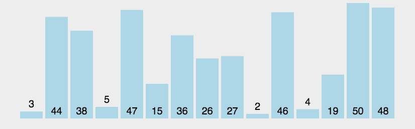
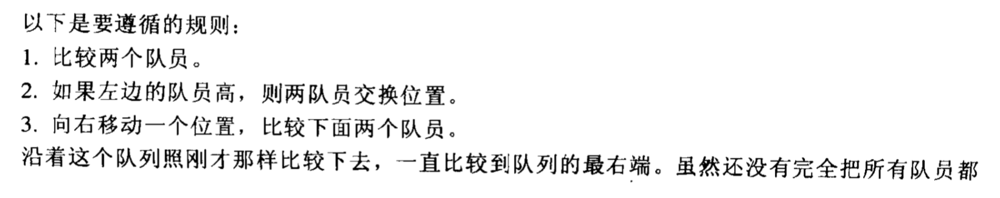
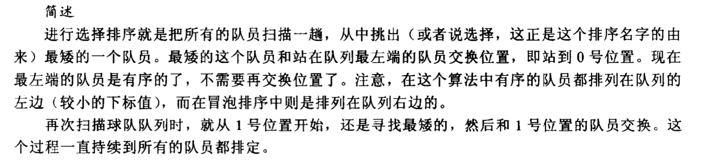
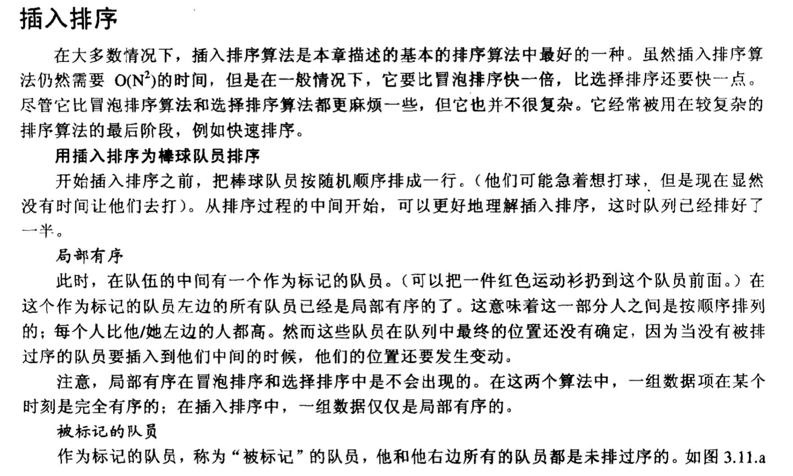
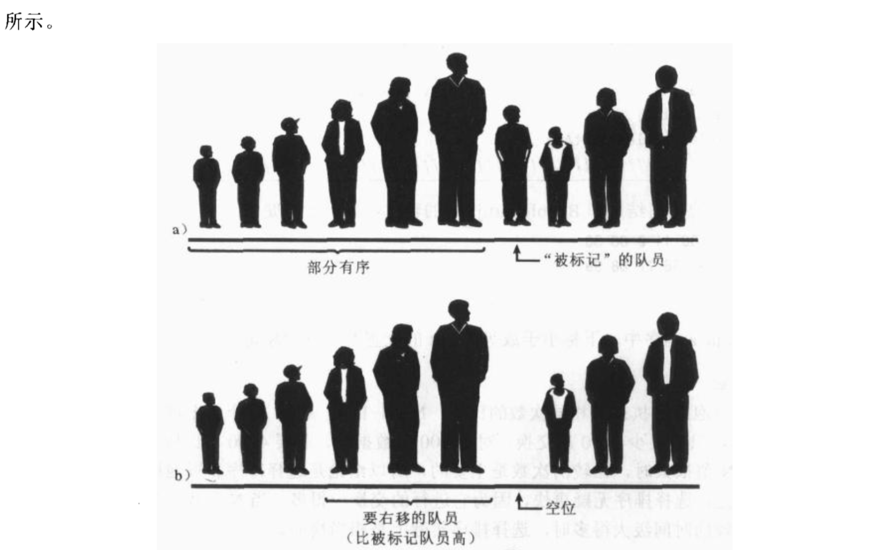
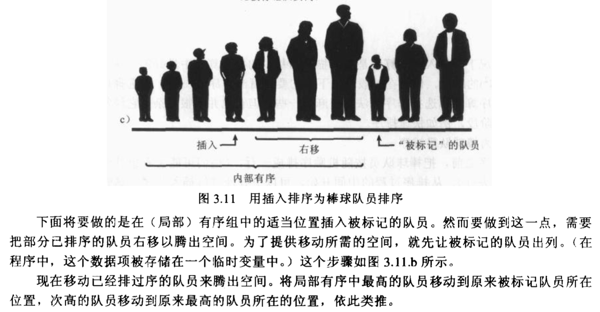

简单排序，包括冒泡、选择、插入，他们的时间复杂度都很高，为 `O(N^2)` 但是相对来说 插入比选择快，选择比冒泡快，下面来看看如何操作。

<!-- more -->

# 1.冒泡排序

&nbsp;&nbsp;&nbsp;&nbsp;&nbsp;&nbsp;源代码在<b><a>[这里](https://github.com/chenzuoli/ETL/tree/master/src/main/java/top/wetech/tools/data_structure/sort/BubbleSort.java)</a></b>

# 2.选择排序

&nbsp;&nbsp;&nbsp;&nbsp;&nbsp;&nbsp;源代码在<b><a>[这里](https://github.com/chenzuoli/ETL/tree/master/src/main/java/top/wetech/tools/data_structure/sort/SelectSort.java)</a></b>

# 3.插入排序

&nbsp;&nbsp;&nbsp;&nbsp;&nbsp;&nbsp;源代码在<b><a>[这里](https://github.com/chenzuoli/ETL/tree/master/src/main/java/top/wetech/tools/data_structure/sort/InsertSort.java)</a></b>