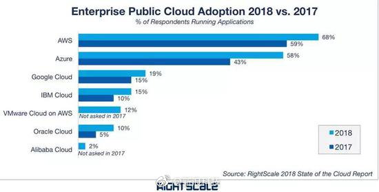

甲骨文公司（英语：Oracle，NASDAQ：ORCL）是一间全球性的大型企业软件公司。总部位于美国加州红木城的红木岸（Redwood Shores），现时首席执行官为公司创办人劳伦斯·埃里森（Lawrence J. Ellison）。
甲骨文是继微软后，全球收入第二多的软件公司。
随着中美之间的贸易摩擦升级，美国软件巨头Oracle公司撤离中国区研发中心，只留下销售部门。这个软件巨头什么来历呢？

<!-- more -->

# 发展历史
---
> 1977年劳伦斯·埃里森、鲍勃·迈纳（Bob Miner）、埃德·奥茨（Ed Oates）在美国加州资成立公司，名为软件发展实验室（Software Development Laboratories，SDL)。其中创始人拉里·埃里森以670亿美元的身价排名全球第六。
> 1978年，开发出第一版甲骨文系统（Oracle），以汇编语言写成；
> 1979年，更名为关连式软件公司（Relational Software, Inc.，RSI)。
> 1982年，推出甲骨文系统，公司也更名为甲骨文系统公司（Oracle Systems Corporation）；
> 2016年，每年的研发投入$22亿美金，应用软件收入$70亿美金，中间件收入$10亿美金。30,000应用软件客户，30,000中间件客户，270,000数据库客户。
> Oracle 在云端 SaaS 上的收入已为全球最大。

# 产品
---
主要分两类：
1.服务器及工具
* 数据库服务器：12c
* 应用服务器：Oracle WebLogic Application Server
* 开发工具：Oracle JDeveloper，Oracle Designer，Oracle Developer，等等

2.应用软件
* 应用软件包与2010年9月20日甲骨文OpenWorld大会上推出的Oracle Fusion Application，一个全面的模块化的应用包；
* 企业资源计划（ERP）软件。已有10年以上的历史。2005年，并购了开发企业软件的仁科软件公司以增强在这方面的竞争力；
* 客户关系管理（CRM）软件。自1998年开始研发这种软件。2005年，并购了开发客户关系管理软件的希柏软件公司（Siebel）；
* 人力资源管理（HCM），收购了仁科（PeopleSoft）软件；

## 操作系统
Solaris
Oracle Linux

## 虚拟技术
Oracle VM
VirtualBox

## Java平台
Java
GlassFish（Sun Java System Application Server）
WebLogic

## 数据库管理系统
Oracle数据库
Berkeley DB
MySQL
Java DB

## 云计算
Oracle Cloud
下图是Oracle Cloud在全球市场份额占比：

## 其它软件
NetBeans
Sun Grid Engine
Sun Studio

# 都有自己的操作系统了，真的厉害
