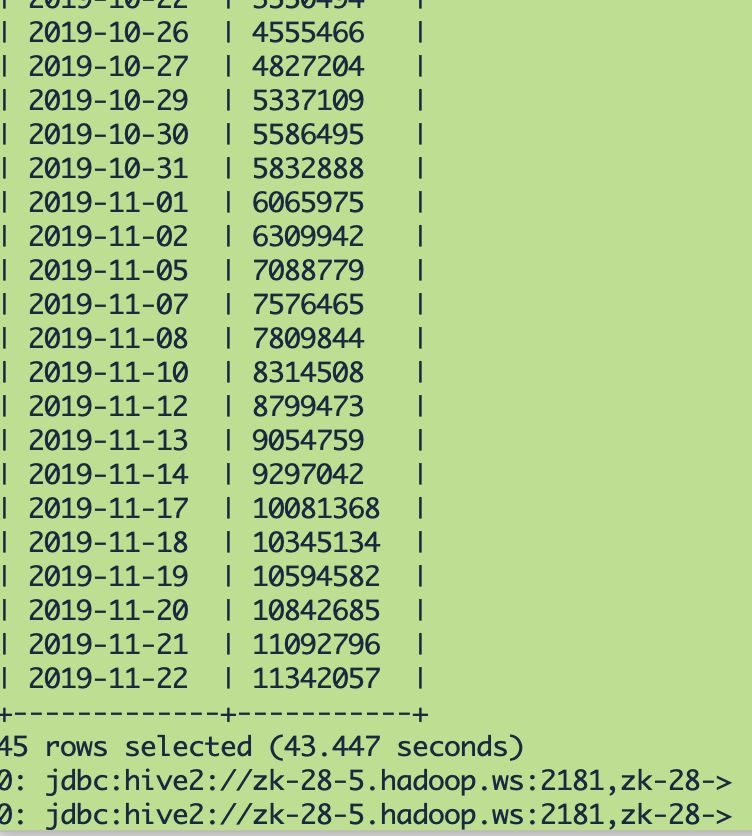
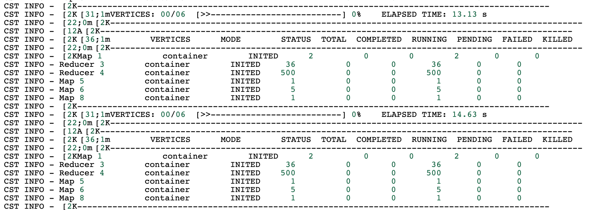
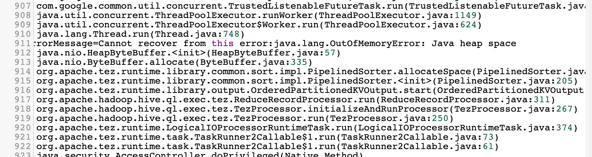
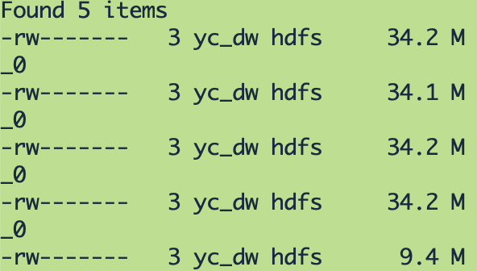
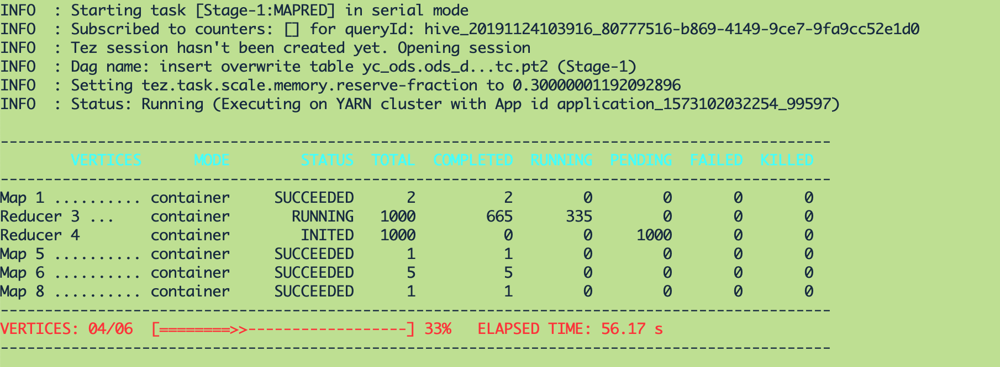
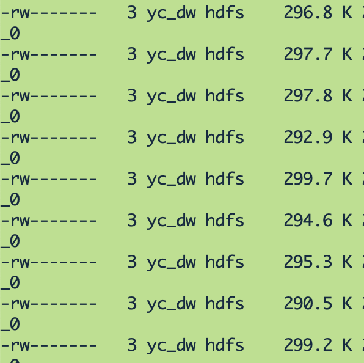

&nbsp;&nbsp;&nbsp;&nbsp;&nbsp;&nbsp;目前运行环境是这样的：
```
hive version: 3.1.0
centos version: 7.4
hadoop version: 3.1.4
```
&nbsp;&nbsp;&nbsp;&nbsp;&nbsp;&nbsp;默认tez引擎


<!-- more -->

&nbsp;&nbsp;&nbsp;&nbsp;&nbsp;&nbsp;此表数据量：


&nbsp;&nbsp;&nbsp;&nbsp;&nbsp;&nbsp;原来设置的参数如下：
```
set hive.merge.mapfiles=true;
set hive.merge.mapredfiles=true;
set hive.merge.smallfiles.avgsize=60000000;
set hive.auto.convert.join.noconditionaltask.size=10000000;
set hive.exec.compress.intermediate=true;
set hive.intermediate.compression.codec=org.apache.hadoop.io.compress.snappycodec;
set hive.intermediate.compression.type=block;
```

&nbsp;&nbsp;&nbsp;&nbsp;&nbsp;&nbsp;运行时


&nbsp;&nbsp;&nbsp;&nbsp;&nbsp;&nbsp;运行结果出现如下错误：


&nbsp;&nbsp;&nbsp;&nbsp;&nbsp;&nbsp;分析：
1. 此表数据量很大；
2. 运行时500个reducer中每个reducer所承载的数据量很大；

&nbsp;&nbsp;&nbsp;&nbsp;&nbsp;&nbsp;昨天此任务运行成功，去hdfs看下结果数据文件情况：

&nbsp;&nbsp;&nbsp;&nbsp;&nbsp;&nbsp;发现结果文件只有5个，而且每个文件34M，可想而知1个reducer当时拉取了大量的数据做聚合，这是导致reducer内存溢出的原因，于是设置reducer个数：
```
set mapred.reduce.tasks=1000;
```

&nbsp;&nbsp;&nbsp;&nbsp;&nbsp;&nbsp;添加参数后运行时：



&nbsp;&nbsp;&nbsp;&nbsp;&nbsp;&nbsp;添加参数后运行结果文件如下：


&nbsp;&nbsp;&nbsp;&nbsp;&nbsp;&nbsp;解决。


- - -
<b>A man is not old until his regrets take place of his dreams.</b>